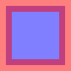
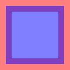
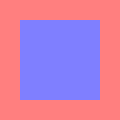
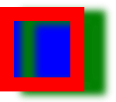
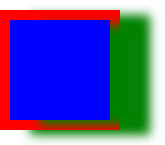
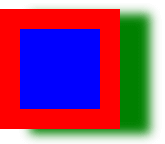

[CanvasRenderingContext2D] fill-and-stroke function
=======
**Status**: explainer

`CanvasRenderingContext2D` offer the possibility to `fill` or `stroke` a path.
Problem is, these are two separate action taken by the renderer.
Meaning that doing both can lead to unexpected conflict between the two functions.

For example, setting shadow option and calling `fill` and `stroke` will draw a shadow for the `fill` and the `stroke`.
There's currently no easy way to draw one shadow for both `fill` and `stroke`.  
Also, when using a lower than `1` `globalAlpha` value, `fill` and `stroke` will overlap.

Moreover, the order in which `fill` and `stroke` are called can drastically change the resulting output.
Putting users are risk of generating unexpected result.


Proposal
--------

```webidl
interface CanvasRenderingContext2D {
    void fillAndStroke();
};
```

`fillAndStroke` will do both `fill` and `stroke` action according to the current `CanvasRenderingContext2D` state.
However, both will be done in a single call and will share the same side effects.

### Open issues and questions

 - Change the name - [#1](https://github.com/GMartigny/canvas-fill-and-stroke/issues/1)


Example usage
-------------

```js
// Javascript example
const canvas = document.createElement("canvas");
const context = canvas.getContext("2d");

context.globalAlpha = 0.5;
context.beginPath();
context.rect(50, 50, 100, 100);
context.fillAndStroke();
```


Demonstration
-------------

| Test | Result | Result (stroke first) | Expected |
| --- | --- | --- | --- |
| Opacity |[](./examples/alpha.html) |[](./examples/alpha-stroke-first.html) |[](./examples/alpha-expected.html) |
| Shadow |[](./examples/shadow.html) |[](./examples/shadow-stroke-first.html) |[](./examples/shadow-expected.html) |


Alternatives considered
-----------------------

### Alternative 1

As per the [proposed polyfill](./src/polyfill.js) file, one could draw in an OffscreenCanvas and render the whole result in one call with `drawImage`.
However, this has a few drawbacks:
 - The added (copy) steps greatly reduce the performance
 - With larger Canvas, `drawImage` has a big impact on memory and performance because of the bitmap reading.
 - This implementation can't read the current path and has to have a `path` given as parameter.
 - This is a hack and surely prone to bugs.

For a peek at the performance drop, check out the [Benchmark page](https://gmartigny.github.io/canvas-fill-and-stroke/benchmark/).


References
----------

none
